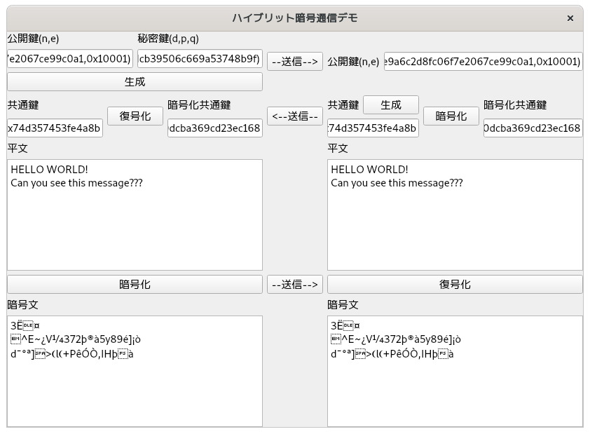

# 超簡易ハイブリット暗号通信デモ

### 必要な外部ライブラリ
* PyQt5(GUIを使用しているため必要)

### 使用暗号
* 共通鍵暗号としてDESを使用。
* 公開鍵暗号としてRSAを使用。
* DESの暗号利用モードとしてCBCモード(Cipher Block Chaining)を使用。
* DESとRSAは共にスクラッチから実装。

### 注意
* デモなためセキュリティは極めて低い。(3DESでない、RSAの鍵のサイズが小さい、疑似乱数を使用、パディングなし、... などなど)
* メッセージは英語のみ対応。(デモのため日本語対応は割愛)
* ネットワーク機能はなし。

### デモ(app/main.py)

### 参考文献
* Understanding Cryptography: A Textbook for Students and Practitioners